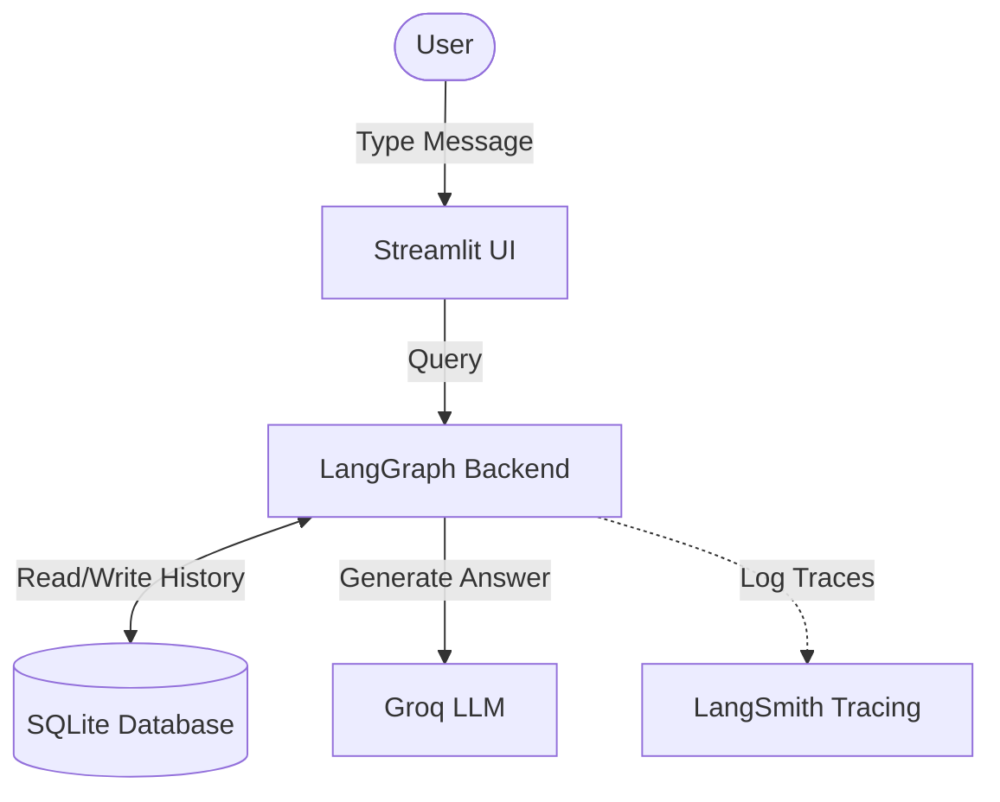

# 🤖 Smart Chatbot with Memory

A simple web-based chatbot application that features persistent conversation history, real-time message streaming, and debugging tracing.

---

## 🚀 Tools Used

*   **[LangGraph](https://github.com/langchain-ai/langgraph)**: Manages the chatbot's flow and conversation state.
*   **[LangChain](https://github.com/langchain-ai/langchain)**: Connects our application to the AI model and formats messages.
*   **[LangSmith](https://www.langchain.com/langsmith)**: Tracks, monitors, and debugs chatbot runs and performance.
*   **SQLite Database (`chatbot.db`)**: Stores conversation history so the chatbot remembers past interactions.
*   **[Streamlit](https://streamlit.io/)**: Powers the web user interface (chat input, messages, sidebar history).
*   **Groq Cloud (Llama 3.3 70B)**: The LLM engine (`llama-3.3-70b-versatile`) that reads queries and generates responses.

---

## 📁 Folder Structure

```filepath
├── backend/
│   ├── graph.py                    # Chatbot brain (LangGraph node, state, & database connection)
│   └── langgraph_backend.ipynb     # Jupyter Notebook for testing and prototyping the backend
├── frontend/
│   ├── app.py                      # Streamlit website interface
│   └── helper.py                   # Helper functions to stream messages and fetch history
├── .env                            # API keys for Groq and LangSmith
├── requirements.txt                # Required Python libraries
└── chatbot.db                      # SQLite database where chat history is saved (created automatically)
```

---

## 📐 Simple Data Flow



1. **User Input**: The user enters a message in the Streamlit frontend.
2. **Context Retrieval**: LangGraph loads the conversation history from the SQLite database using a unique session ID.
3. **LLM Query & Streaming**: The graph calls the Groq LLM to generate a response, which is streamed back to the UI.
4. **Observability**: LangSmith tracks the backend execution steps for debugging.

---

## 🛠️ Setup and Run

### 1. Open the Project Folder
```bash
cd Chatbot
```

### 2. Activate Python Virtual Environment
*   **Windows:** `myenv\Scripts\activate`
*   **Mac/Linux:** `source myenv/bin/activate`

### 3. Install Libraries
```bash
pip install -r requirements.txt
```

### 4. Set Up API Keys (`.env` file)
Create a `.env` file in the root folder with the following variables:
```env
GROQ_API_KEY=your_groq_api_key
LANGSMITH_TRACING=true
LANGSMITH_ENDPOINT=https://api.smith.langchain.com
LANGCHAIN_API_KEY=your_langchain_api_key
LANGCHAIN_PROJECT=chatbot_project
```

### 5. Run the Application
```bash
streamlit run frontend/app.py
```
Open `http://localhost:8501` in your browser.
